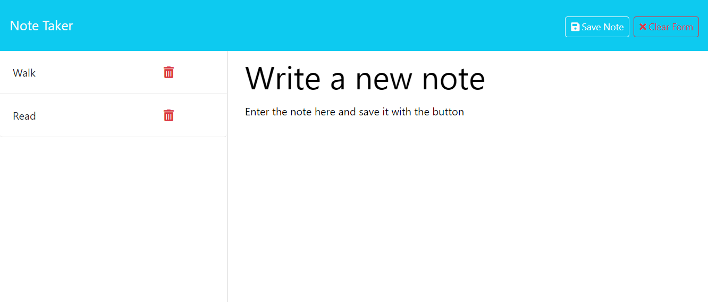

# Note Taker

## Purpose

This is a simple application to write and save notes. The application uses Express.js back end and saves and retrieves note data from a JSON file.

## Instructions

The user opens the note-taking application and clicks on a link to the notes page. The user is then presented with a page with existing notes listed in the left-hand column, plus empty fields to enter a new note title and the note's text in the right hand column.

The user can enter a new note title. A "save note" button and a "clear form" button appear in navigation at the top of the page.

When the user clicks the Save button the new note is saved and added to the notes on the left column. A "new note" button appears in the navigation, which the user can click to start a new note.

## Screenshot

## Contact Me

Feel free to reach out to me if you have any questions, suggestions, or collaboration opportunities.

- **Email**: ccbabb@gmail.com
- **GitHub**: https://github.com/Babbalicious

## License

This project is licensed under the [MIT License](https://opensource.org/licenses/MIT).

